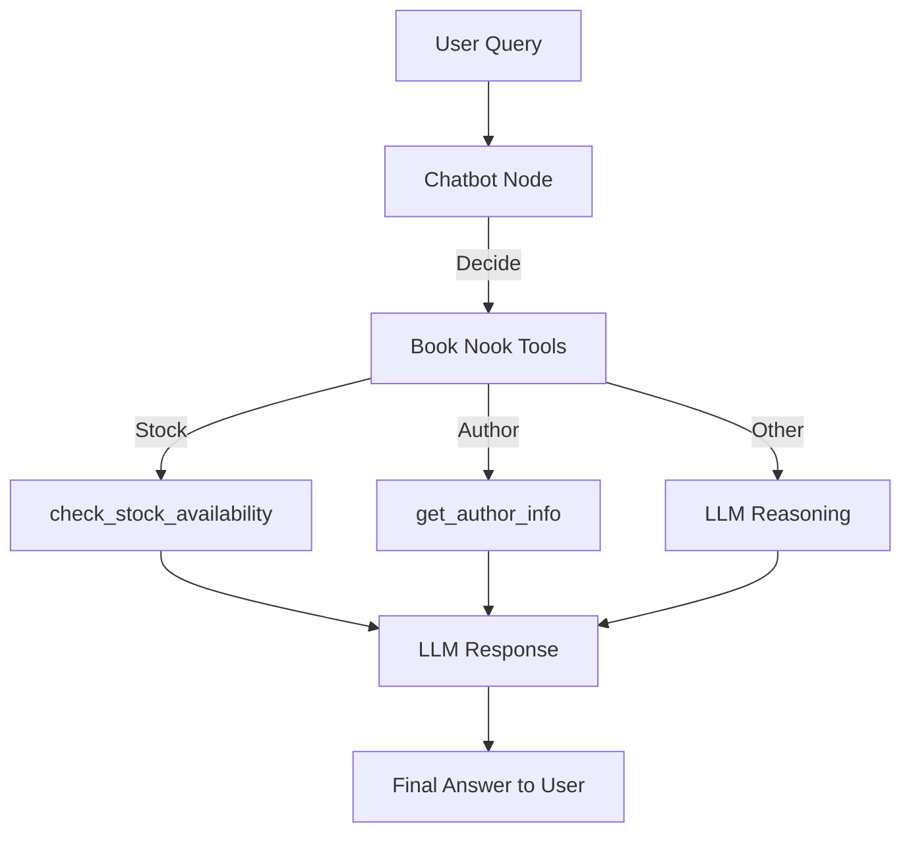
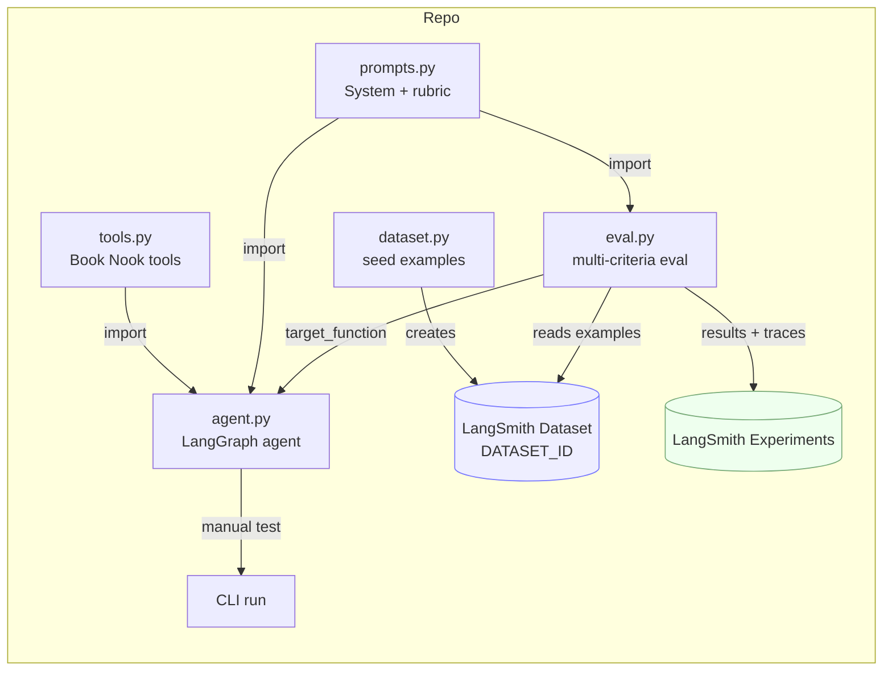
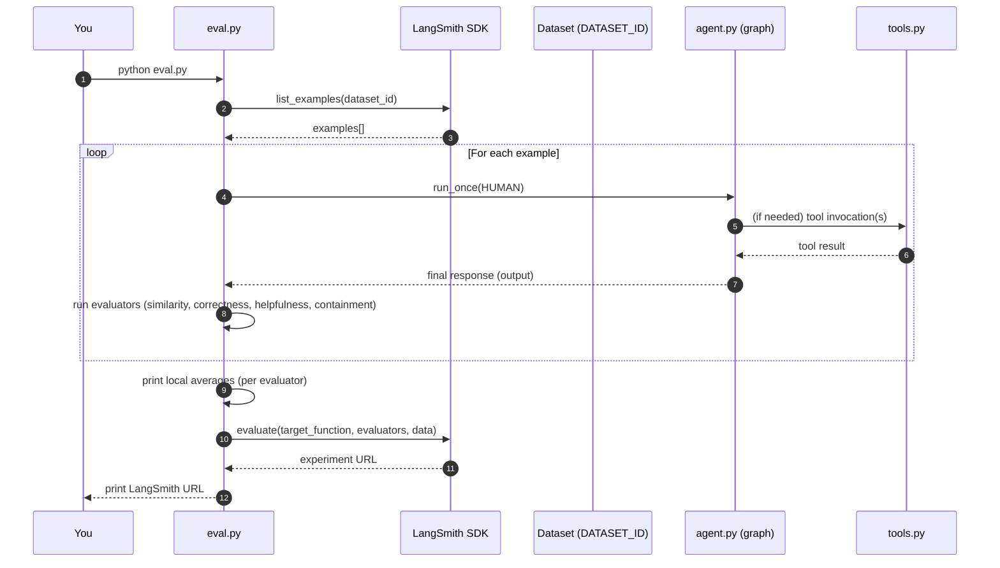

# Book Nook — LangGraph Agent with LangSmith Evaluation

This project is my response to the **Sr TSE LangGraph + LangSmith Prompt**.

It demonstrates:
- A **LangGraph-based agent** for a fictional bookstore, *Book Nook*.
- **Custom tools** for book stock lookup and author info.
- A **synthetic dataset** for evaluation.
- A **multi-criteria evaluation** pipeline using LangSmith (SDK + UI).
- A **friction log** to capture what worked, what was confusing, and what could improve.

---

## 🔄 Agent Flow



---

## 📂 Project Structure

```
.
├── agent.py        # Defines LangGraph agent (Book Nook chatbot)
├── tools.py        # Custom Book Nook tools (stock + author info)
├── prompts.py      # System prompt and rubric for correctness eval
├── dataset.py      # Seeds LangSmith dataset with synthetic examples
├── eval.py         # Runs evaluation (local summary + LangSmith)
├── friction.md     # Notes on pain points / feedback
└── requirements.txt
```

---

## 🧩 Script Flow (How the pieces fit)



---

## 📈 Evaluation Sequence (SDK call-by-call)



---

## 🚀 How to Run

1. **Set environment variables** in `.env`:
   ```env
   LANGSMITH_API_KEY=...
   DATASET_ID=...
   GEMINI_API_KEY=...
   GEMINI_MODEL=gemini-1.5-flash
   ```

2. **Install dependencies**:
   ```bash
   pip install -r requirements.txt
   ```

3. **Seed dataset**:
   ```bash
   python dataset.py
   ```

4. **Smoke test the agent**:
   ```bash
   python agent.py
   ```

5. **Run evaluation**:
   ```bash
   python eval.py
   ```
   Example output:
   ```
   === Local Evaluation Summary (Immediate) ===
   Similarity : 9.25/10
   Correctness: 9.00/10
   Helpfulness: 8.75/10
   Containment: 8.50/10

   ✅ View the LangSmith evaluation results at:
   https://smith.langchain.com/.../experiments/...
   ```

---

## 📊 What You’ll Share
- **Code snippets / repo link**  
- **Walkthrough (~15min)** covering:
  - What you built  
  - How you evaluated it  
  - What you learned  
  - What might confuse a new user  
- **Friction log** (below)
