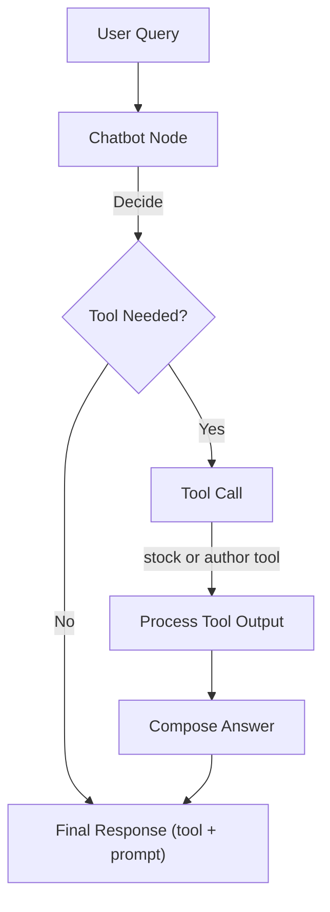
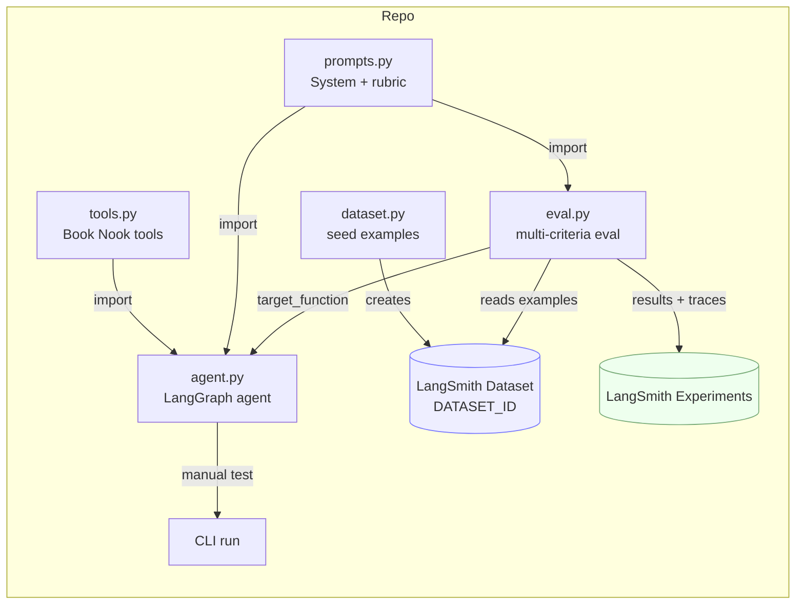

# 📚 Book Nook Assistant Agent

Simple [LangGraph-based](https://www.langchain.com/langgraph) ReAct bookstore agent for the fictional **Book Nook**, a cozy haven for readers.

---

### Features
- Answers book-related questions (authors, stock, light recs).
- Utilizes **custom tools**:
  - `check_stock_availability` — mock inventory lookup  
  - `get_author_info` — mock author biographies
- Friendly responses guided by a **system prompt**.
- Evaluated with **LangSmith** using multiple criteria (similarity, correctness, helpfulness, containment).

---

## 🔄 Agent Flow





- **Node**: `chatbot` wraps the system prompt and calls the ReAct agent (Gemini + tools).  
- **Edges**: `START → chatbot → END`.  
- **State**: running list of messages (`System`, `Human`, `AI`).  

---

## 📂 Project Structure

```
.
├── agent.py        # LangGraph agent (Gemini + tools)
├── tools.py        # Book Nook tools (stock + author info)
├── prompts.py      # System prompt + correctness rubric
├── dataset.py      # Seeds LangSmith dataset with synthetic Q&A
├── eval.py         # Runs evaluation (local summary + LangSmith)
├── friction.md     # Friction log (setup + dev challenges)
└── requirements.txt
```

---

## 🧩 Script Flow (How the pieces fit)



- **`dataset.py`** → uploads examples to the LangSmith dataset (`DATASET_ID`).  
- **`agent.py`** → compiles the LangGraph agent (Gemini + tools) and offers a CLI smoke test.  
- **`eval.py`** → pulls examples, calls the same agent, runs 4 evaluators, prints local summary, records a LangSmith experiment.  

---

## 🚀 Getting Started

### 1) Environment
This project requires **Python 3.9+**.

```bash
python -m venv .venv
source .venv/bin/activate
pip install -r requirements.txt
```

Create `.env`:
```env
GEMINI_API_KEY=your_gemini_api_key
GEMINI_MODEL=gemini-1.5-flash

LANGSMITH_API_KEY=your_langsmith_api_key
DATASET_ID=your_langsmith_dataset_id
```

### 2) Seed the dataset
```bash
python dataset.py
```

### 3) Smoke test the agent
```bash
python agent.py
```
Try:
```
Who wrote Dracula?
Do you have Sherlock Holmes in stock?
Recommend me something like Sherlock Holmes.
```
Type `quit` or `exit` to leave.

### 4) Run the evaluation
```bash
python eval.py
```

Example output:
```
=== Local Evaluation Summary (Immediate) ===
Similarity : 9.25/10
Correctness: 9.00/10
Helpfulness: 8.75/10
Containment: 8.50/10

✅ View the LangSmith evaluation results at:
https://smith.langchain.com/.../experiments/...
```

---

## 📊 Evaluation Criteria

- **Semantic Similarity** — LLM-as-judge  
- **Correctness** — rubric-based (from `prompts.py`)  
- **Helpfulness** — LLM-as-judge  
- **Containment** — rule-based token overlap  

---

## 🌱 Possible Improvements

```mermaid
flowchart TD
    A[Current ReAct Agent] --> B{Extend Capabilities?}

    B -- Add Tools --> T[More Tools\n• pricing\n• new releases\n• events]
    B -- Add RAG --> R[RAG Pipeline\n(embeddings + vector store)]
    B -- Memory --> M[Short-term Memory\n(conversation history)]
    B -- HITL --> H[Human-in-the-Loop\n(escalation / approval)]
    B -- Feedback --> F[User Feedback Loop\n(thumbs / rubric capture)]

    R --> R1[Embed Query]
    R1 --> R2[Search Vector Store]
    R2 --> R3[Retrieve Context]
    R3 --> R4[Compose Answer\n(prompt + retrieved)]

    H --> H1[Detect Uncertainty / Risk]
    H1 --> H2[Route to Human]
```

- **More tools**: pricing, promotions, events/calendar.  
- **RAG**: add a vector store for larger catalogs and bibliographic data.  
- **Memory**: keep short conversation history for follow-ups.  
- **Human-in-the-loop**: allow escalation or approval for sensitive answers.  
- **Feedback**: capture user ratings to refine prompts/evaluators.  

---

## 🔗 Links
- 🔧 [LangGraph Docs](https://langchain-ai.github.io/langgraph/concepts/why-langgraph/)
- 🔧 [ReAct agent](https://python.langchain.com/api_reference/langchain/agents/langchain.agents.react.agent.create_react_agent.html)
- 📘 [LangSmith Evaluation Docs](https://docs.smith.langchain.com/evaluation)
- 🎓 [LangSmith Academy](https://academy.langchain.com/courses/intro-to-langsmith)
